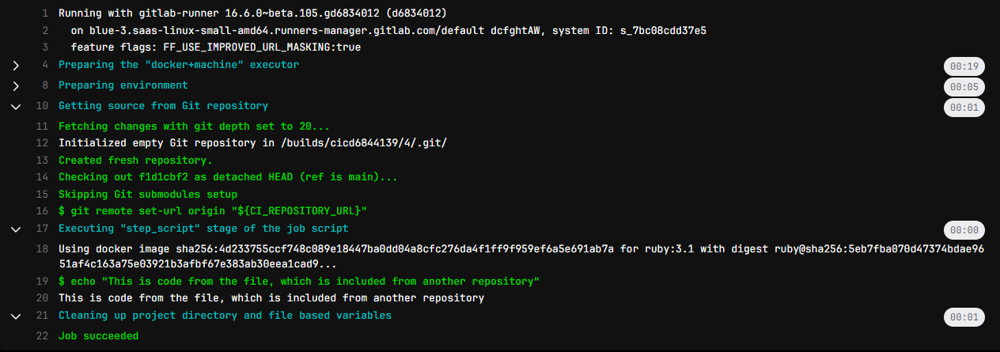

# Урок 4. Troubleshooting (диагностика и решение проблем в CI/CD)

## Задание:
Сделать отдельный репозиторий с шаблонами, подключить его к своему основному репозиторию через include.

## Решение:

Файл `.gitlab-ci.yml` из основного репозитория:
```
include:
  - remote: https://gitlab.com/cicd6844139/5/-/raw/main/remote-included-file.yml
  - local: local-included-file.yml
```

Файл `remote-included-file.yml` из другого репозитория:
```
remote included file job:
  script:
    - echo "This is code from the file, which is included from another repository"
```

Результат:


